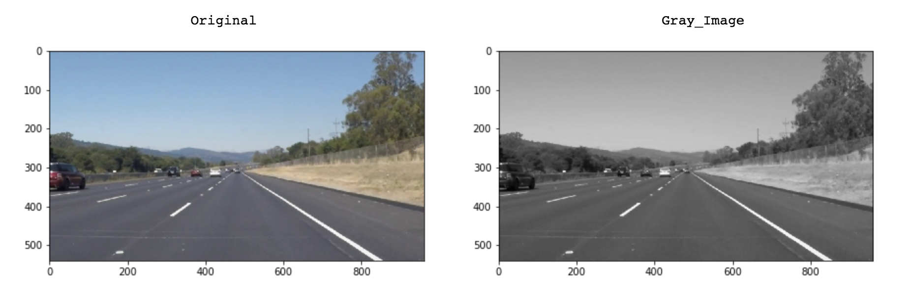
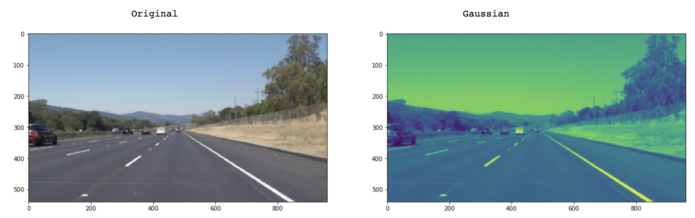
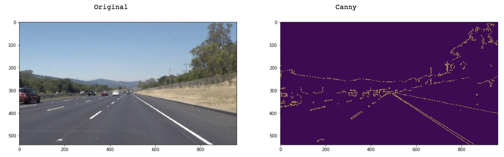
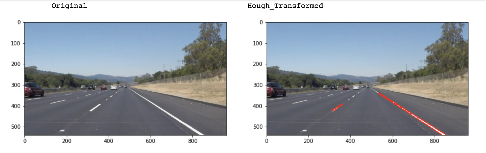
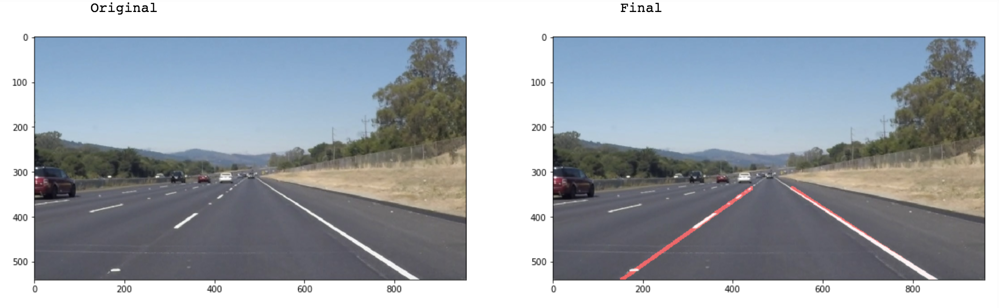

# **Finding Lane Lines on the Road** 

### Reflection

### 1. Describe your pipeline. As part of the description, explain how you modified the draw_lines() function.

My pipeline consisted of 5 steps. First, I converted the images to grayscale, then I .... 

In order to draw a single line on the left and right lanes, I modified the draw_lines() function by ...

If you'd like to include images to show how the pipeline works, here is how to include an image: 

![alt text][image1]

My pipeline consisted of 6 steps. 

* Step 1: Convert Image to grayscale
* Step 2: Smoothen Edges with Gaussian Blur
* Step 3: Apply Canny edge detection on Smoothened Images
* Step 4: Use Region Of Interest and discard all lines outside this region
* Step 5: Perform a Hough Transform to find lanes within our region of interest and trace them in red
* Step 6: Using hough lines from step 5 and draw lines on original image

**Step 1**: Convert Image to grayscale

We then convert the images to Grayscale. We use the OpenCV's function cv2.cvtColor(img, cv2.COLOR_RGB2GRAY)

**Step 2**: Smoothen Edges with Gaussian Blur

We use Gaussian Blur to smoothen the edges in the Gray scaled images from the previous step. In the OpenCV function, the more the kernel size we choose, the more the blurring happens. For our purposes, we choose a kernel size of 5

**Step 3**: Apply Canny Edge Detector

We apply a Canny Edge detector on the smoothened images. For a Canny edge detector, we have an OpenCV function for Canny Edge detection , where we see that larger the threshold , the less the noise in the blurred images. We choose lower threshold = 150 and higher threshold = 250 

**Step 4**: Use Region Of Interest and discard all lines outside this region

In this step, we get Vertices that help define the contours of a polygon. This polygon would encapsulate all the lines that are of interest to us, discarding all noise that we are not interested in

We then use the cv2.fillPoly and cv2.polylines , which are part of the region_of_interest for region selections. 

**Step 5**: Perform a Hough Transform to find lanes within our region of interest and trace them in red

The hough transform, for which I used the provided hough_lines(), is used to draw the detected lines over the original images using the draw_lines()

#### How I modified draw_lines()?

The draw_lines() was actually left unchanged, but I created the average_lines() function, that was used to do the following

**a**: The output of the pre-modification draw_lines() is the below image. We can see that there is no uniform line, there is a double line on the right most lane. 

![Step5_Before][Before_Modification.png]

**b**: We need to reduce the line information from the hough transform to two lines. For this, we calculate the slopes of the lines output by the hough transform

**c**: We then compare the slopes of the lines, group them by positive and negative slope values. In this case, positive will be right lane, negative will be our left lane. 

**d**: Then we average out both the points values and extrapolate the values on to the top of our region of interest. This gives us two seperate lines. 

**Step 6**: Using hough lines from step 5 and draw lines on original image

We can then use the included weighted_img() function to create a solid and transparent line, that runs through the length of the visible lanes

![Step6][Step6.png]

### 2. Identify potential shortcomings with your current pipeline

**1**: One of the biggest problems this might face is the fact that , if there are curved lanes in the frame, this might fail. 
**2**: This does not take into account, frame information from the previous frame. At some point in time, we will need information to understand changes in road design. This program is not currently able to do that. 

### 3. Suggest possible improvements to your pipeline

A possible suggestion would be to use information from previous frames. Like Slope information, and run it though a RNN or some other algorithm that is better able to predict the next frame. This should make our program more robust at finding lanes and adapting to lane changes. 
